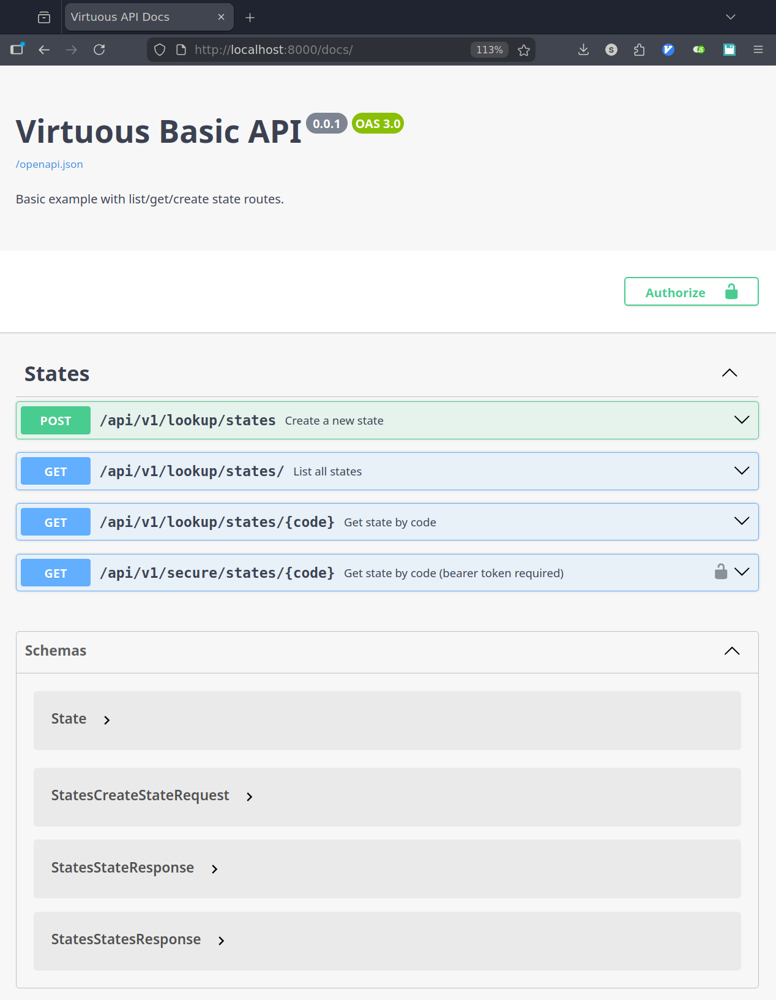

# Virtuous

Virtuous is an **agent-first API framework for Go** with **self-generating documentation and clients**.

It provides a **typed router** as a thin, zero-dependency wrapper around Go’s `net/http` package. Your handlers define everything--routes, schemas, auth, docs, and client SDKs.

## Why Virtuous

- **Typed handlers** - request/response types generate OpenAPI and clients automatically.
- **Typed guards** - auth as composable middleware with self-describing metadata.
- **Native SDKs** - simple, correct clients for Python, JavaScript, and TypeScript.
- **Agent-friendly** - patterns optimized for reliable code generation.
- **Zero dependencies** - Go 1.22+, standard library only.  no CLI, no codegen step, no YAML; routes and types define everything.

## Quick start (cut, paste, run)

Create a new project:

```bash
mkdir virtuous-demo
cd virtuous-demo
go mod init virtuous-demo
go get github.com/swetjen/virtuous@latest
```

Create `main.go`:

```go
package main

import (
	"fmt"
	"log"
	"net/http"

	"github.com/swetjen/virtuous"
)

type State struct {
	ID   int32  `json:"id" doc:"Numeric state ID."`
	Code string `json:"code" doc:"Two-letter state code."`
	Name string `json:"name" doc:"Display name for the state."`
}

type StatesResponse struct {
	Data  []State `json:"data"`
	Error string  `json:"error,omitempty"`
}

type StateResponse struct {
	State State  `json:"state"`
	Error string `json:"error,omitempty"`
}

func main() {
	if err := RunServer(); err != nil {
		log.Fatal(err)
	}
}

func RunServer() error {
	router := virtuous.NewRouter()

	router.HandleTyped(
		"GET /api/v1/lookup/states/",
		virtuous.WrapFunc(StatesGetMany, nil, StatesResponse{}, virtuous.HandlerMeta{
			Service: "States",
			Method:  "GetMany",
			Summary: "List all states",
			Tags:    []string{"states"},
		}),
	)

	router.HandleTyped(
		"GET /api/v1/lookup/states/{code}",
		virtuous.WrapFunc(StateByCode, nil, StateResponse{}, virtuous.HandlerMeta{
			Service: "States",
			Method:  "GetByCode",
			Summary: "Get state by code",
			Tags:    []string{"states"},
		}),
	)

	router.ServeAllDocs()

	server := &http.Server{
		Addr:    ":8000",
		Handler: router,
	}
	fmt.Println("Listening on :8000")
	return server.ListenAndServe()
}

func StatesGetMany(w http.ResponseWriter, r *http.Request) {
	var response StatesResponse
	for _, state := range mockData {
		response.Data = append(response.Data, State{
			ID:   state.ID,
			Code: state.Code,
			Name: state.Name,
		})
	}

	virtuous.Encode(w, r, http.StatusOK, response)
}

func StateByCode(w http.ResponseWriter, r *http.Request) {
	var response StateResponse
	code := r.PathValue("code")
	if code == "" {
		response.Error = "code is required"
		virtuous.Encode(w, r, http.StatusBadRequest, response)
		return
	}

	for _, state := range mockData {
		if state.Code == code {
			response.State = state
			virtuous.Encode(w, r, http.StatusOK, response)
			return
		}
	}

	response.Error = "code not found"
	virtuous.Encode(w, r, http.StatusBadRequest, response)
}

var mockData = []State{
	{
		ID:   1,
		Code: "mn",
		Name: "Minnesota",
	},
	{
		ID:   2,
		Code: "tx",
		Name: "Texas",
	},
}

```

Run it:

```bash
go run .
```

Open `http://localhost:8000/docs/` to view the Swagger UI.



## Requirements

- Go 1.22+ (for method-prefixed route patterns like `GET /path`)

## Install

```bash
go get github.com/swetjen/virtuous@latest
```

## Router wiring 

Virtuous is router-first.

Use the Virtuous router directly as your server handler and let it serve APIs, docs, and clients from a single server:
```text
http.Server
  -> Virtuous Router
     -> /api routes
     -> /docs
     -> /openapi.json
     -> /client.gen.*
```

## Handler metadata

`HandlerMeta` describes how a typed route appears in generated clients and OpenAPI:

- `Service` and `Method` group methods into client services.
- `Summary` and `Description` show up in OpenAPI and JS JSDoc.
- `Tags` are emitted as OpenAPI tags.

## Output generation

Virtuous can emit OpenAPI schemas and client SDKs directly to disk:

```go
openapiJSON, err := router.OpenAPI()
if err != nil {
	log.Fatal(err)
}
_ = os.WriteFile("openapi.json", openapiJSON, 0644)

f, _ := os.Create("client.gen.js")
_ = router.WriteClientJS(f)

py, _ := os.Create("client.gen.py")
_ = router.WriteClientPY(py)

ts, _ := os.Create("client.gen.ts")
_ = router.WriteClientTS(ts)
```

Notes:
- `/openapi.json` can be served directly for Swagger UI or similar tools.
- Client SDKs can be written at startup or served dynamically.
- Pointer fields are emitted as nullable in OpenAPI.
- Swagger UI auto-prepends GuardSpec.Prefix for header-based auth schemes.
- Client outputs include a Virtuous client hash for versioning and drift detection.
- Hash endpoints can be served via:
  - `router.ServeClientJSHash`
  - `router.ServeClientTSHash`
  - `router.ServeClientPYHash`

## Guards (auth middleware)

Guards combine middleware with explicit auth metadata:

Guards serve two purposes:
- Enforce authentication in handlers
- Describe auth requirements to docs and generated clients

```go
type bearerGuard struct{}

func (bearerGuard) Spec() virtuous.GuardSpec {
	return virtuous.GuardSpec{
		Name:   "BearerAuth",
		In:     "header",
		Param:  "Authorization",
		Prefix: "Bearer",
	}
}

func (bearerGuard) Middleware() func(http.Handler) http.Handler {
	return func(next http.Handler) http.Handler {
		return http.HandlerFunc(func(w http.ResponseWriter, r *http.Request) {
			// validate token here
			next.ServeHTTP(w, r)
		})
	}
}
```

Register guarded routes:

```go
router.HandleTyped(
	"GET /api/v1/secure/states/{code}",
	virtuous.Wrap(http.HandlerFunc(StateByCode), nil, StateResponse{}, virtuous.HandlerMeta{
		Service: "States",
		Method:  "GetByCodeSecure",
		Summary: "Get state by code (bearer token required)",
	}),
	bearerGuard{},
)
```

## Examples

Basic example (`example/basic/`)
- List/get/create state routes
- Generates OpenAPI + JS/TS/PY clients

Template example (`example/template/`)
- Admin routes with guard middleware
- CORS applied at the router boundary
- Static landing page with docs links

Larger example app with React embedded (`example/`)
- Guarded routes and admin workflows
- OpenAPI + JS/TS/PY client generation

## Troubleshooting

- Missing OpenAPI/client output: ensure routes are method-prefixed and typed (`HandleTyped` or `Wrap`).
- Missing client method names: ensure `HandlerMeta.Service` and `HandlerMeta.Method` are set.
- Auth header missing prefix in Swagger UI: set `GuardSpec.Prefix`.

## Spec
See `SPEC.md` for the detailed specification.

## Agent quickstart
See `docs/agent_quickstart.md` for a focused guide for agents building services.

## Using Virtuous in Python

Virtuous includes a zero-dependency Python loader that fetches a client from a URL and returns a ready-to-use module.

Install the loader:

```bash
pip install virtuous
```

```python
from virtuous import load_module

module = load_module("http://localhost:8000/client.gen.py")
client = module.create_client("http://localhost:8000")
states = client.States.getMany()
```

## Using Virtuous in JavaScript

```js
import { createClient } from "./client.gen.js"

const client = createClient("http://localhost:8000")
const states = await client.States.getMany()
```

## Using Virtuous in TypeScript

```ts
import { createClient } from "./client.gen"

const client = createClient("http://localhost:8000")
const states = await client.States.getMany()
```

## Acknowledgements

Virtuous is inspired by the Oto project from Pace.dev and Matt Ryer.
