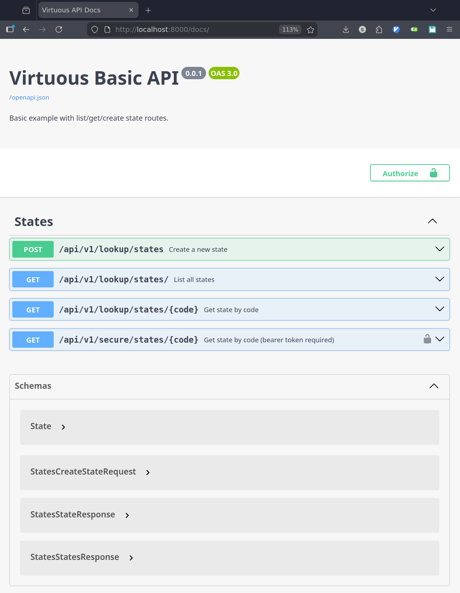

# Virtuous

Virtuous is an **agent-first, typed RPC API framework for Go** with **self-generating docs and clients**.

[](https://github.com/swetjen/virtuous/tags)
[](https://github.com/swetjen/virtuous/actions/workflows/ci.yaml)
[](go.mod)
[](https://github.com/swetjen/virtuous/blob/main/LICENSE)

**RPC-first:** APIs are plain Go functions with typed inputs and outputs, served over HTTP. Routes, schemas, docs, and JS/TS/Python clients are generated at runtime from those functions.

**Compatibility:** `httpapi` wraps existing `net/http` handlers when you must preserve a legacy shape or migrate gradually. New work should start with RPC.

## Table of contents

- [RPC](#rpc)
- [HTTP API (httpapi)](#http-api-httpapi)
- [Combined (migration demo)](#combined-migration-demo)
- [Why RPC?](#why-rpc)
- [Docs](#docs)
- [Requirements](#requirements)

## Why RPC (default)

Virtuous treats APIs as **typed functions** instead of loosely defined HTTP resources. That keeps the surface area small, predictable, and agent-friendly.

What this means in practice:

- Inputs/outputs are Go structs; they *are* the contract and generate OpenAPI + SDKs automatically.
- Routes derive from package + function names, so naming stays consistent without manual path design.
- A minimal handler status model (200/422/500) keeps error handling explicit and uniform.
- Docs and clients are emitted from the running server, so they cannot drift from the code.

`httpapi` stays in the toolbox for teams migrating existing handlers or preserving exact legacy responses.

## RPC

RPC uses plain Go functions with typed requests and responses.  
Routes, schemas, and clients are inferred from package and function names.

This model minimizes surface area, avoids configuration drift, and produces predictable client code.

### Quick start (cut, paste, run)

```bash
mkdir virtuous-demo
cd virtuous-demo
go mod init virtuous-demo
go get github.com/swetjen/virtuous@latest
```

Create `main.go`:

```go
package main

import (
	"context"
	"fmt"
	"log"
	"net/http"

	"github.com/swetjen/virtuous/rpc"
)

type GetStateRequest struct {
	Code string `json:"code" doc:"Two-letter state code."`
}

type State struct {
	ID   int32  `json:"id" doc:"Numeric state ID."`
	Code string `json:"code" doc:"Two-letter state code."`
	Name string `json:"name" doc:"Display name for the state."`
}

type StateResponse struct {
	State State  `json:"state"`
	Error string `json:"error,omitempty"`
}

func GetState(_ context.Context, req GetStateRequest) (StateResponse, int) {
	if req.Code == "" {
		return StateResponse{Error: "code is required"}, http.StatusUnprocessableEntity
	}
	return StateResponse{
		State: State{ID: 1, Code: req.Code, Name: "Minnesota"},
	}, http.StatusOK
}

func main() {
router := rpc.NewRouter(rpc.WithPrefix("/rpc"))
router.HandleRPC(GetState)
router.ServeAllDocs()

	server := &http.Server{Addr: ":8000", Handler: router}
	fmt.Println("Listening on :8000")
	log.Fatal(server.ListenAndServe())
}
```



Run it:

```bash
go run .
```

### Advanced patterns

#### 1) One guard for a collection of routes (group-level)

Use a dedicated router for the guarded group, then mount both routers on one mux.

```go
admin := rpc.NewRouter(
	rpc.WithPrefix("/rpc/admin"),
	rpc.WithGuards(sessionGuard{}), // applies to every admin route
)
admin.HandleRPC(adminusers.GetMany)
admin.HandleRPC(adminusers.Disable)

public := rpc.NewRouter(rpc.WithPrefix("/rpc/public"))
public.HandleRPC(publichealth.Check)

mux := http.NewServeMux()
mux.Handle("/rpc/admin/", admin)
mux.Handle("/rpc/public/", public)
```

If you wrap a mux subtree with middleware directly, that works for transport security, but `rpc.WithGuards(...)` is the docs/client-aware path because it emits OpenAPI security metadata.

#### 2) Multiple documentation sets (Public Service, Secret Service)

Today, one router emits one OpenAPI document for all routes on that router.
For separate docs, split routes across routers.

```go
publicAPI := rpc.NewRouter(rpc.WithPrefix("/rpc/public"))
publicAPI.HandleRPC(publicsvc.GetCatalog)
publicAPI.ServeAllDocs(
	rpc.WithDocsOptions(
		rpc.WithDocsPath("/rpc/public/docs"),
		rpc.WithOpenAPIPath("/rpc/public/openapi.json"),
	),
	rpc.WithClientJSPath("/rpc/public/client.gen.js"),
	rpc.WithClientTSPath("/rpc/public/client.gen.ts"),
	rpc.WithClientPYPath("/rpc/public/client.gen.py"),
)

secretAPI := rpc.NewRouter(
	rpc.WithPrefix("/rpc/secret"),
	rpc.WithGuards(internalTokenGuard{}),
)
secretAPI.HandleRPC(secretsvc.RotateKeys)
secretAPI.ServeAllDocs(
	rpc.WithDocsOptions(
		rpc.WithDocsPath("/rpc/secret/docs"),
		rpc.WithOpenAPIPath("/rpc/secret/openapi.json"),
	),
	rpc.WithClientJSPath("/rpc/secret/client.gen.js"),
	rpc.WithClientTSPath("/rpc/secret/client.gen.ts"),
	rpc.WithClientPYPath("/rpc/secret/client.gen.py"),
)

mux := http.NewServeMux()
mux.Handle("/rpc/public/", publicAPI)
mux.Handle("/rpc/secret/", secretAPI)
```

#### 3) Basic auth on the docs route

Protect docs/OpenAPI paths at the top-level mux.

```go
func docsBasicAuth(user, pass string, next http.Handler) http.Handler {
	return http.HandlerFunc(func(w http.ResponseWriter, r *http.Request) {
		u, p, ok := r.BasicAuth()
		if !ok || u != user || p != pass {
			// Sends a Basic Auth challenge so browsers show a username/password prompt.
			w.Header().Set("WWW-Authenticate", `Basic realm="Virtuous Docs"`)
			http.Error(w, "unauthorized", http.StatusUnauthorized)
			return
		}
		next.ServeHTTP(w, r)
	})
}

router := rpc.NewRouter(rpc.WithPrefix("/rpc"))
router.HandleRPC(states.GetMany)
router.ServeAllDocs()

mux := http.NewServeMux()
mux.Handle("/rpc/", router) // API routes
mux.Handle("/rpc/openapi.json", docsBasicAuth("docs", "secret", router))
mux.Handle("/rpc/docs", docsBasicAuth("docs", "secret", router))
mux.Handle("/rpc/docs/", docsBasicAuth("docs", "secret", router))
```

Note: there is no first-class docs auth option yet; mux-level middleware is the current path.

#### 4) OR auth semantics (accept either of two schemes)

When a route should accept either credential type, express that logic in one composite guard and attach it once.

```go
type bearerOrAPIKeyGuard struct {
	bearer bearerGuard
	apiKey apiKeyGuard
}

func (g bearerOrAPIKeyGuard) Spec() guard.Spec {
	return guard.Spec{
		Name:  "BearerOrApiKey",
		In:    "header",
		Param: "Authorization",
	}
}

func (g bearerOrAPIKeyGuard) Middleware() func(http.Handler) http.Handler {
	return func(next http.Handler) http.Handler {
		return http.HandlerFunc(func(w http.ResponseWriter, r *http.Request) {
			if g.bearer.authenticate(r) || g.apiKey.authenticate(r) {
				next.ServeHTTP(w, r)
				return
			}
			http.Error(w, "unauthorized", http.StatusUnauthorized)
		})
	}
}
```

### Handler signature

RPC handlers must follow one of these forms:

```go
func(context.Context, Req) (Resp, int)
func(context.Context) (Resp, int)
```

### Status model

RPC handlers return an HTTP status code directly.

Supported statuses:

- `200` — success
- `422` — invalid input
- `500` — server error

Guarded routes may also return `401` when middleware rejects the request.

Docs and SDKs are served at:

- `/rpc/docs`
- `/rpc/client.gen.*`
- Observability dashboard: `/rpc/_virtuous/observability` or the `Observability` tab inside `/rpc/docs/`
- Metrics JSON: `/rpc/_virtuous/metrics`
- Responses should include a canonical `error` field (string or struct) when errors occur.

### Observability

Basic per-RPC request metrics are tracked in memory by default. Advanced error grouping, guard metrics, and sampled traces are opt-in.

```go
router := rpc.NewRouter(
	rpc.WithPrefix("/rpc"),
	rpc.WithAdvancedObservability(
		rpc.WithObservabilitySampling(0.25),
	),
)

router.HandleRPC(states.GetMany, auth.BearerGuard{})
router.ServeAllDocs()
```

This enables:

- `/rpc/_virtuous/metrics` for JSON metrics
- `/rpc/_virtuous/observability` as a redirect into the docs dashboard
- the `Observability` tab in `/rpc/docs/`

### DB Explorer

Virtuous can attach a read-only runtime DB explorer to the `Database` tab in `/rpc/docs/`.

```go
router := rpc.NewRouter(
	rpc.WithPrefix("/rpc"),
	rpc.WithDBExplorer(
		rpc.NewPGXDBExplorer(pool),
	),
)
```

SQLite:

```go
router := rpc.NewRouter(
	rpc.WithPrefix("/rpc"),
	rpc.WithDBExplorer(
		rpc.NewSQLDBExplorer(pool),
	),
)
```

The explorer uses the same runtime credentials/pool and enforces:

- read-only `SELECT`/`WITH` queries
- single statement only
- hard timeout (default `5s`)
- hard row cap (default `1000`)

## HTTP API (httpapi)

`httpapi` wraps classic `net/http` handlers and preserves existing request/response shapes. It also emits OpenAPI 3.0 specs for typed handlers.

Use this when:
- Migrating an existing API to Virtuous
- Developing rich HTTP APIs
- Maintaining compatibility with established OpenAPI contracts

### Quick start

Method-prefixed patterns (`GET /path`) are required for docs and client generation.
Typed `httpapi` routes are JSON-focused for generated docs/clients. `string` and `[]byte` responses are supported directly, and `HandlerMeta.Responses` can declare custom media types and multiple statuses.

```go
router := httpapi.NewRouter()
router.HandleTyped(
	"GET /api/v1/lookup/states/{code}",
	httpapi.WrapFunc(StateByCode, nil, StateResponse{}, httpapi.HandlerMeta{
		Service: "States",
		Method:  "GetByCode",
	}),
)
router.ServeAllDocs()
```

### Advanced patterns

#### 1) One guard for a collection of routes (group-level intent)

`httpapi` does not have a router-wide `WithGuards(...)` option today.
Use a shared guard slice and pass it to each route in the collection.

```go
adminGuards := []httpapi.Guard{sessionGuard{}}

router := httpapi.NewRouter()
router.HandleTyped(
	"GET /api/admin/users",
	httpapi.WrapFunc(AdminUsersGetMany, nil, UsersResponse{}, httpapi.HandlerMeta{
		Service: "AdminUsers",
		Method:  "GetMany",
	}),
	adminGuards...,
)
router.HandleTyped(
	"POST /api/admin/users/disable",
	httpapi.WrapFunc(AdminUsersDisable, nil, DisableUserResponse{}, httpapi.HandlerMeta{
		Service: "AdminUsers",
		Method:  "Disable",
	}),
	adminGuards...,
)
```

If you apply middleware only at mux level, requests are still protected, but auth metadata is not emitted in OpenAPI unless guards are attached to typed routes.

#### 2) Multiple documentation sets (Public Service, Secret Service)

Use separate routers, each with its own docs/OpenAPI/client paths.

```go
publicAPI := httpapi.NewRouter()
publicAPI.HandleTyped(
	"GET /public/health",
	httpapi.WrapFunc(PublicHealth, nil, HealthResponse{}, httpapi.HandlerMeta{
		Service: "PublicService",
		Method:  "Health",
	}),
)
publicAPI.ServeAllDocs(
	httpapi.WithDocsOptions(
		httpapi.WithDocsPath("/public/docs"),
		httpapi.WithOpenAPIPath("/public/openapi.json"),
	),
	httpapi.WithClientJSPath("/public/client.gen.js"),
	httpapi.WithClientTSPath("/public/client.gen.ts"),
	httpapi.WithClientPYPath("/public/client.gen.py"),
)

secretGuards := []httpapi.Guard{internalTokenGuard{}}
secretAPI := httpapi.NewRouter()
secretAPI.HandleTyped(
	"POST /secret/rotate-keys",
	httpapi.WrapFunc(RotateKeys, nil, RotateKeysResponse{}, httpapi.HandlerMeta{
		Service: "SecretService",
		Method:  "RotateKeys",
	}),
	secretGuards...,
)
secretAPI.ServeAllDocs(
	httpapi.WithDocsOptions(
		httpapi.WithDocsPath("/secret/docs"),
		httpapi.WithOpenAPIPath("/secret/openapi.json"),
	),
	httpapi.WithClientJSPath("/secret/client.gen.js"),
	httpapi.WithClientTSPath("/secret/client.gen.ts"),
	httpapi.WithClientPYPath("/secret/client.gen.py"),
)

mux := http.NewServeMux()
mux.Handle("/public/", publicAPI)
mux.Handle("/secret/", secretAPI)
```

#### 3) Basic auth on the docs route

Protect docs/OpenAPI paths at the top-level mux.

```go
func docsBasicAuth(user, pass string, next http.Handler) http.Handler {
	return http.HandlerFunc(func(w http.ResponseWriter, r *http.Request) {
		u, p, ok := r.BasicAuth()
		if !ok || u != user || p != pass {
			// Sends a Basic Auth challenge so browsers show a username/password prompt.
			w.Header().Set("WWW-Authenticate", `Basic realm="Virtuous Docs"`)
			http.Error(w, "unauthorized", http.StatusUnauthorized)
			return
		}
		next.ServeHTTP(w, r)
	})
}

router := httpapi.NewRouter()
router.HandleTyped(
	"GET /api/v1/lookup/states/{code}",
	httpapi.WrapFunc(StateByCode, nil, StateResponse{}, httpapi.HandlerMeta{
		Service: "States",
		Method:  "GetByCode",
	}),
)
router.ServeAllDocs()

mux := http.NewServeMux()
mux.Handle("/", router) // API routes
mux.Handle("/openapi.json", docsBasicAuth("docs", "secret", router))
mux.Handle("/docs", docsBasicAuth("docs", "secret", router))
mux.Handle("/docs/", docsBasicAuth("docs", "secret", router))
```

Note: there is no first-class docs auth option yet; mux-level middleware is the current path.

#### 4) OR auth semantics (accept either of two schemes)

When a route should accept either credential type, express that logic in one composite guard and attach it once.

```go
type bearerOrAPIKeyGuard struct {
	bearer bearerGuard
	apiKey apiKeyGuard
}

func (g bearerOrAPIKeyGuard) Spec() guard.Spec {
	return guard.Spec{
		Name:  "BearerOrApiKey",
		In:    "header",
		Param: "Authorization",
	}
}

func (g bearerOrAPIKeyGuard) Middleware() func(http.Handler) http.Handler {
	return func(next http.Handler) http.Handler {
		return http.HandlerFunc(func(w http.ResponseWriter, r *http.Request) {
			if g.bearer.authenticate(r) || g.apiKey.authenticate(r) {
				next.ServeHTTP(w, r)
				return
			}
			http.Error(w, "unauthorized", http.StatusUnauthorized)
		})
	}
}
```

#### 5) Optional request body contract

Request bodies are required by default when you pass a typed request.
Use `httpapi.Optional` when a route should accept either no body or a JSON body.

```go
router := httpapi.NewRouter()
router.HandleTyped(
	"POST /api/v1/search",
	httpapi.WrapFunc(Search, httpapi.Optional[SearchRequest](), SearchResponse{}, httpapi.HandlerMeta{
		Service: "Search",
		Method:  "Run",
	}),
)
```

#### 6) Explicit response specs

Use `HandlerMeta.Responses` when a route needs multiple statuses or a custom response media type.

```go
router := httpapi.NewRouter()
router.HandleTyped(
	"GET /api/v1/assets/{id}/preview.png",
	httpapi.WrapFunc(ServePreviewPNG, nil, nil, httpapi.HandlerMeta{
		Service: "Assets",
		Method:  "GetPreview",
		Responses: []httpapi.ResponseSpec{
			{Status: 200, Body: []byte{}, MediaType: "image/png"},
			{Status: 404, Body: ErrorResponse{}},
		},
	}),
)
```

## Combined (migration demo)

Both routers can be mounted in the same server to support incremental migration.

This layout is intended for transition periods, not as a long-term structure.

```go
httpRouter := httpstates.BuildRouter()

rpcRouter := rpc.NewRouter(rpc.WithPrefix("/rpc"))
rpcRouter.HandleRPC(rpcusers.UsersGetMany)
rpcRouter.HandleRPC(rpcusers.UserCreate)

mux := http.NewServeMux()
mux.Handle("/rpc/", rpcRouter)
mux.Handle("/", httpRouter)
```

## Why RPC?

Virtuous uses an RPC-style API model because it produces **simpler, more reliable systems**—especially when APIs are consumed by agents.

RPC treats APIs as **typed functions**, not as collections of loosely related HTTP resources. This keeps the surface area small and the intent explicit.

### What RPC optimizes for

- **Clarity over convention** — function names express intent directly, without guessing paths or schemas.
- **Types as the contract** — request and response structs *are* the API; no separate schema to sync.
- **Predictable code generation** — small, explicit signatures produce reliable client SDKs.
- **Fewer invalid states** — avoids ambiguous partial updates, nested resources, and overloaded semantics.
- **Runtime truth** — routes, schemas, docs, and clients all derive from the same runtime definitions.

### HTTP still matters

Virtuous RPC runs on HTTP and uses HTTP status codes intentionally.  
What changes is the *mental model*: from “resources and verbs” to “operations with inputs and outputs.”

For teams migrating existing APIs or preserving established contracts, Virtuous also supports classic `net/http` handlers via `httpapi`.

RPC is the default because it’s **harder to misuse and easier to automate**.


## Docs

- `docs/overview.md` — primary documentation (RPC-first)
- `docs/agent_quickstart.md` — agent-oriented usage guide
- `example/byodb/docs/STYLEGUIDES.md` — byodb styleguide index and canonical flow

## Requirements

- Go 1.25+
